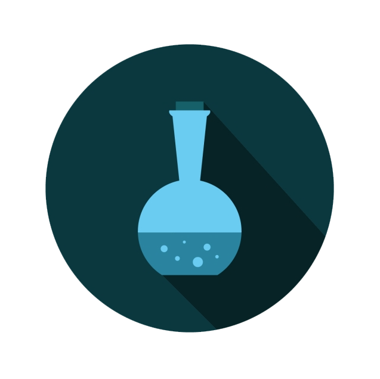
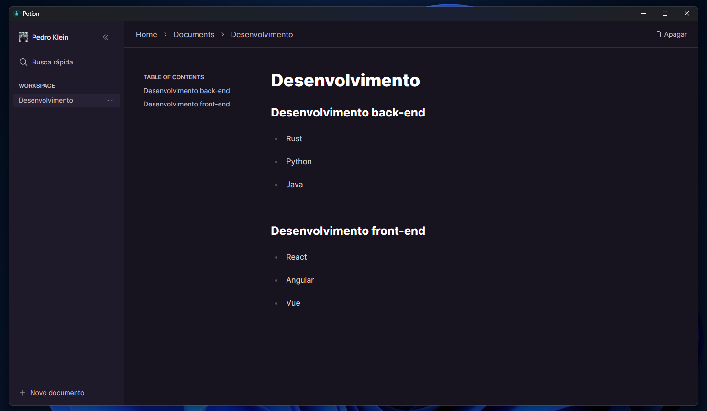

<h1 align="center" style="display: flex; align-items: center; width: 100%; justify-content: center; gap: 1rem;" >
    
Potion

    
</h1>

Este é um aplicatiovo <i>"Notion style"</i>, desenvolvido com Tauir (Typescript + Rust). Com suporte a markdown, é um gerenciador de textos com salvamento de arquivos offline, como arquivo físico na própria máquina. 

  <a href="#-tecnologias">Tecnologias</a>&nbsp;&nbsp;&nbsp;|&nbsp;&nbsp;&nbsp;
  <a href="#-projeto">Projeto</a>&nbsp;&nbsp;&nbsp;|&nbsp;&nbsp;&nbsp;
  <a href="#-layout">Layout</a>&nbsp;&nbsp;&nbsp;|&nbsp;&nbsp;&nbsp;
  <a href="#memo-licença">Licença</a>

  

 

  

## 🚀 Tecnologias

Esse projeto foi desenvolvido com as seguintes tecnologias:

- HTML, CSS e JavaScript
- Git e Github
- Biblotecas:
    - [tauri](https://tauri.app)
    - [react](https://pt-br.reactjs.org)
    - [typescript](https://www.typescriptlang.org)
    - [shadcn/ui](https://ui.shadcn.com)
    - [tiptap](https://tiptap.dev)
    - [cmdk](https://cmdk.paco.me)
    - [lucide-react](https://lucide.dev)
    - [rust](https://rust-lang.github.io/rustup/concepts/channels.html)
    - [sqlite](https://www.sqlite.org)

## 💻 Projeto

Esse é um projeto utilizado para aprender na prática o funcionamento do Rust. É uma aplicação totalmente offline, com seus documentos salvos em um arquivo na própria máquina.

## :memo: Licença

Esse projeto está sob a licença MIT.

---

## ✍ Author
 

    Made with 💜 by Pedro Henrique Klein

    
    

